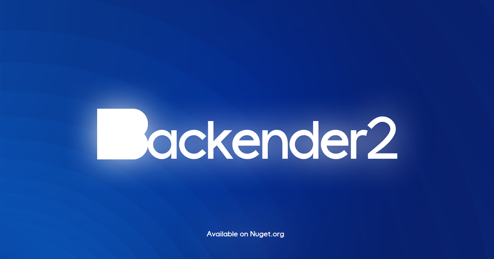

<p align="center" style="margin-top: 10px;">
  
</p>

### Backender
Backender is a dynamic open-source project crafted in C#. It empowers your website by automating the creation of its backend infrastructure using the repository pattern. With Backender, you can swiftly and efficiently develop a robust backend, transforming your vision into reality.

### Table of Contents
- [Nuget Packages](#nuget-packages)
- [Getting Started](#getting-started)
- [Sample of Blueprint File](#sample-of-blueprint-file)
- [More Information](#more-information)
## Nuget Packages

| Package | NuGet Stable |  Downloads |
| ------- | -------- | ------- |
| [Backender.CLI](https://www.nuget.org/packages/Backender.CLI/) | [](https://www.nuget.org/packages/Backender.CLI/)  | [](https://www.nuget.org/packages/Backender.CLI/) |

### Getting Started

1. Install from .NET Core Global Tool  

  ``` shell
    dotnet tool install --global Backender.CLI --version 2.0.2
  ```

2. Create or edit Blueprint file
3. the command line executes the Backender command.
    - Backender
    - wait for prompt to enter the Blueprint file path
    - carriage return execution command
4. wait for the end of the task execution.
5. Edit the created projects as you need.
6. Enjoy the time saved!

### Sample of Blueprint File
``` xml
<Blueprint ValidationControl="FluentValidation">
<Solution Name="GoBlog" Namespace="GoBlog"/>
<Domains>
<Enum Name="CommentStatus">
<EnumValue Name="Pending" Value="1"/>
<EnumValue Name="Accepted" Value="2"/>
<EnumValue Name="Failed" Value="3"/>
</Enum>
<Entity Name="Post">
<Col Name="Title" Type="string"/>
<Col Name="Author" Type="string"/>
<Col Name="Content" Type="string"/>
</Entity>
<Entity Name="Comment">
<Col Name="Name" Type="string"/>
<Col Name="CommentStatus" Type="CommentStatus"/>
<Col Name="Email" Type="string" Options="email"/>
<Col Name="Content" Type="string"/>
</Entity>
<Entity Name="Category">
<Col Name="Title" Type="string"/>
<Col Name="Description" Type="string" Options="DisplayName(توضیحات) required"/>
</Entity>
<RelationShip Entity1="Post" Entity2="Comment" Type="O2M"/>
<RelationShip Entity1="Category" Entity2="Post" Type="O2M"/>
<GlobalOption Id="ShortString" EntityCols="root.Title, Post.All(), Post.Comment" Options="Length(0,250) required"/>
</Domains>
</Blueprint>
```

   - **Tags Explanation:**
     - `<Blueprint>`: Defines the Blueprint file and its configuration with the following attributes:
       - `ValidationControl` (optional): Specifies the validation control mechanism for the Blueprint. Allowed values include: `FluentValidation`, `DataAnnotations`.
     - `<Entity>`: Defines an entity with the following attributes:
       - `Name` (required): Specifies the name of the entity.
       - `Category` (optional): Specifies the category or group to which the entity belongs.

     - `<Col>`: Defines a column within an entity with the following attributes:
       - `Name` (required): Specifies the name of the column.
       - `Type` (required): Specifies the data type of the column. 
       - `options` (optional): Specifies the options for the column, such as validation rules.

     - `<RelationShip>`: Defines a relationship between two entities with the following attributes:
       - `Entity1` (required): Specifies the name of the first entity in the relationship.
       - `Entity2` (required): Specifies the name of the second entity in the relationship.
       - `Type` (required): Specifies the type of relationship. Allowed values include: `O2O` (One-to-One), `O2M` (One-to-Many), `M2M` (Many-to-Many).

     - `<Enum>`: Defines an enumeration with the following attributes:
       - `Name` (required): Specifies the name of the enumeration.

     - `<EnumValue>`: Defines a value within an enumeration with the following attributes:
       - `Name` (required): Specifies the name of the value.
       - `Value` (required): Specifies the corresponding value for the enumeration value.

     - `<Solution>`: Specifies the name and namespace of the solution with the following attributes:
       - `Name` (required): Specifies the name of the solution.
       - `Namespace` (required): Specifies the namespace of the solution.

     - `<Reference>`: References other blueprint files, allowing the reuse of entity definitions with the following attributes:
       - `Href` (required): Specifies the path or location of the referenced blueprint file.
       - `Type` (required): Specifies the type of reference. Allowed values include: `Partial/blueprint`,`template/blueprint`.
      - `<GlobalOption>`: Sets global options for entity columns, allowing the application of options to multiple columns at once. It has the following attributes:
         - `EntityCols` (required): Specifies the target columns to which the options should be applied.
         - `Options` (required): Specifies the options to be applied to the target columns.
### More Information
[Introducing Backender 2: Enhanced Speed, Blueprints, Validations, and More](https://medium.com/@mahdihoseinpoor/introducing-backender-2-enhanced-speed-blueprints-validations-and-more-b91d64c59741)

[Blueprint: The Only Thing That Backender Needs](https://medium.com/@mahdihoseinpoor/blueprint-the-only-thing-that-backender-needs-61128924aa5c)

    
