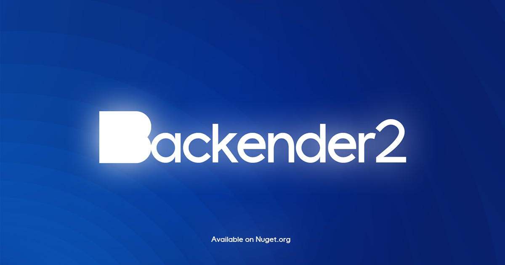

<p align="center" style="margin-top: 10px;">
  
</p>

# Backender

Backender is a powerful open-source C# tool that automates the creation of your website's backend infrastructure. By utilizing the repository pattern and a simple XML blueprint file, Backender allows you to rapidly generate a robust and scalable backend, saving you valuable development time.

| Package | NuGet Stable |  Downloads |
| ------- | -------- | ------- |
| [Backender.CLI](https://www.nuget.org/packages/Backender.CLI/) | [](https://www.nuget.org/packages/Backender.CLI/)  | [](https://www.nuget.org/packages/Backender.CLI/) |

## Table of Contents
- [About The Project](#about-the-project)
- [Getting Started](#getting-started)
- [Usage](#usage)
- [Blueprint File Explained](#blueprint-file-explained)
- [License](#license)
- [More Information](#more-information)

## About The Project

Backender is designed to streamline the backend development process. Instead of writing boilerplate code for data models, repositories, and services, you can define your application's structure in a simple XML file called a "Blueprint." Backender then reads this file and generates the necessary C# code for your project.

### Key Features:
*   **Code Generation:** Automatically generates a complete backend structure based on your Blueprint file.
*   **Repository Pattern:** Implements the repository pattern for clean and maintainable data access.
*   **Customizable:** You can easily modify the generated code to fit your specific needs.
*   **Validation:** Supports both FluentValidation and DataAnnotations for data validation.
*   **Relationships:** Define one-to-one, one-to-many, and many-to-many relationships between your entities.

## Getting Started

### Prerequisites

*   .NET Core SDK

### Installation

1.  Install the Backender CLI from the .NET Core Global Tool repository:
    ```shell
    dotnet tool install --global Backender.CLI --version 2.0.2
    ```

## Usage

1.  **Create a Blueprint File:** Create an XML file (e.g., `blueprint.xml`) to define your application's entities, properties, and relationships.
2.  **Run Backender:** Open your terminal and run the following command:
    ```shell
    Backender
    ```
3.  **Enter File Path:** When prompted, enter the path to your Blueprint file.
4.  **Enjoy:** Backender will generate the backend code for your project. You can then open the generated solution in your favorite IDE and start building your application.

## Blueprint File Explained

The Blueprint file is the heart of Backender. It's a simple XML file that defines the structure of your application.

### Sample Blueprint File
```xml
<Blueprint ValidationControl="FluentValidation">
    <Solution Name="GoBlog" Namespace="GoBlog"/>
    <Domains>
        <Enum Name="CommentStatus">
            <EnumValue Name="Pending" Value="1"/>
            <EnumValue Name="Accepted" Value="2"/>
            <EnumValue Name="Failed" Value="3"/>
        </Enum>
        <Entity Name="Post">
            <Col Name="Title" Type="string"/>
            <Col Name="Author" Type="string"/>
            <Col Name="Content" Type="string"/>
        </Entity>
        <Entity Name="Comment">
            <Col Name="Name" Type="string"/>
            <Col Name="CommentStatus" Type="CommentStatus"/>
            <Col Name="Email" Type="string" Options="email"/>
            <Col Name="Content" Type="string"/>
        </Entity>
        <Entity Name="Category">
            <Col Name="Title" Type="string"/>
            <Col Name="Description" Type="string" Options="DisplayName(توضیحات) required"/>
        </Entity>
        <RelationShip Entity1="Post" Entity2="Comment" Type="O2M"/>
        <RelationShip Entity1="Category" Entity2="Post" Type="O2M"/>
        <GlobalOption Id="ShortString" EntityCols="root.Title, Post.All(), Post.Comment" Options="Length(0,250) required"/>
    </Domains>
</Blueprint>
```

### Tag Explanations

*   `<Blueprint>`: The root element of the Blueprint file.
    *   `ValidationControl` (optional): Specifies the validation library to use (`FluentValidation` or `DataAnnotations`).
*   `<Solution>`: Defines the name and namespace for your generated solution.
*   `<Entity>`: Represents a data model in your application.
    *   `Name`: The name of the entity.
*   `<Col>`: Represents a property of an entity.
    *   `Name`: The name of the property.
    *   `Type`: The data type of the property.
    *   `Options` (optional): Additional options for the property (e.g., validation rules).
*   `<RelationShip>`: Defines a relationship between two entities.
    *   `Entity1`, `Entity2`: The names of the entities in the relationship.
    *   `Type`: The type of relationship (`O2O`, `O2M`, `M2M`).
*   `<Enum>`: Defines an enumeration.
*   `<EnumValue>`: Defines a value for an enumeration.
*   `<GlobalOption>`: Applies options to multiple columns at once.

## License

Distributed under the Apache-2.0 License. See `LICENSE.txt` for more information.

## More Information
*	[Introducing Backender 2: Enhanced Speed, Blueprints, Validations, and More](https://medium.com/@mahdihoseinpoor/introducing-backender-2-enhanced-speed-blueprints-validations-and-more-b91d64c59741)
*	[Blueprint: The Only Thing That Backender Needs](https://medium.com/@mahdihoseinpoor/blueprint-the-only-thing-that-backender-needs-61128924aa5c)
